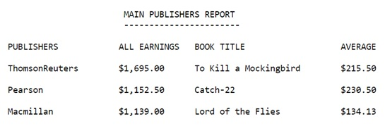
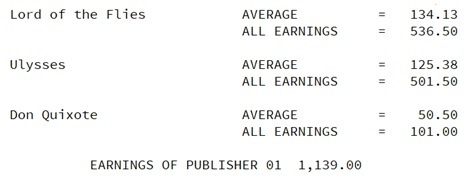

# PublishersReport
This program creates a Report for main Publishers. More precisely, it presents the most popular Books, their average earnings and more. All of these from the top Publishers, since only a selected few are presented.

 

## Additional information
This program also presents a series of “Displays” with the information as follows:

 

## How to run this service
-  The Cobol program needs the archives inside bin.zip to run properly;
-  After the execution of _MainPublishers.Cbl_, it creates the Report _MainPublishers.rpt_ into the bin folder.
 
